## 引言

本教程面向希望快速搭建 Kuikly 开发环境以编译和开发 OpenHarmony 项目的开发者。我们采用“克隆仓库 + 运行脚本”的方式完成环境配置——相较于通过 Android Studio 搭建 Kuikly 环境的传统方法，该方案流程更简洁、操作更高效，尤其适合初学者和追求开发效率的用户。本文基于 2026 年最新实践编写，配有详细步骤与图示，助您轻松上手 OpenHarmony 应用开发。

## 一、搭建Kuikly环境教程

### 1.1 创建文件目录

新建一个Kuikly文件夹用来保存创建的Kuikly项目。

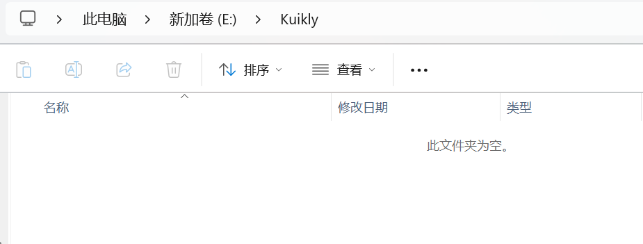

### 1.2 新增测试文件夹

在该文件夹新增一个KuiklyTest测试文件夹，用来入门开发

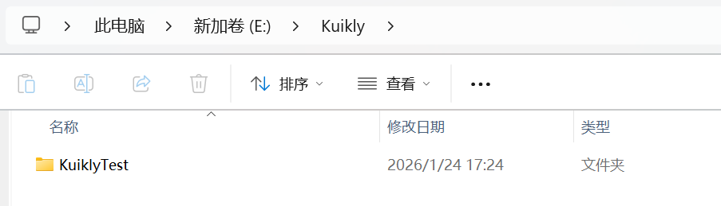

### 1.3 拉取官方代码

前置条件：电脑里面需要安装 Git，如果没有，可以看我的这篇文章进行配置安装。

[【2026 最新】下载安装 Git 详细教程 （Windows）](https://blog.csdn.net/2301_80035882/article/details/155000175?spm=1001.2014.3001.5502)

双击进入文件夹，上方输入cmd，点击Enter

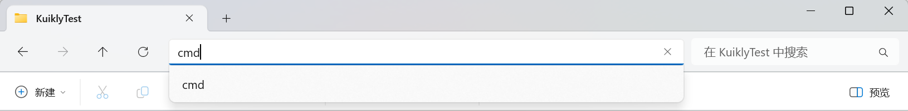

输入：

```
git clone https://gitcode.com/Tencent-TDS/KuiklyUI.git
```

鼠标右键粘贴：

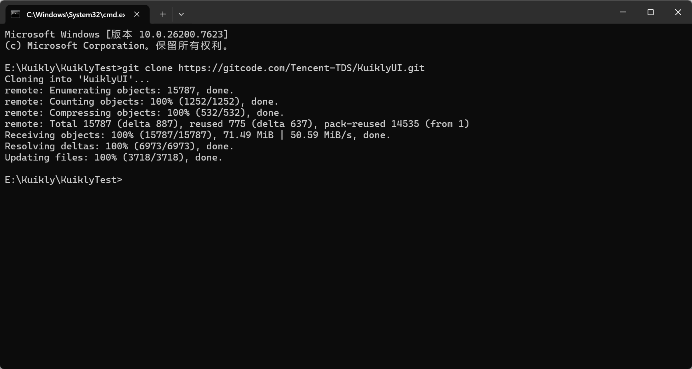

代码执行完了，我们的KuiklyTest就会多出来一个KuiklyUI的文件夹。

我们再双击进去查看文件夹里面是否有内容，如果有内容就是正常的，没有内容就是有问题的。

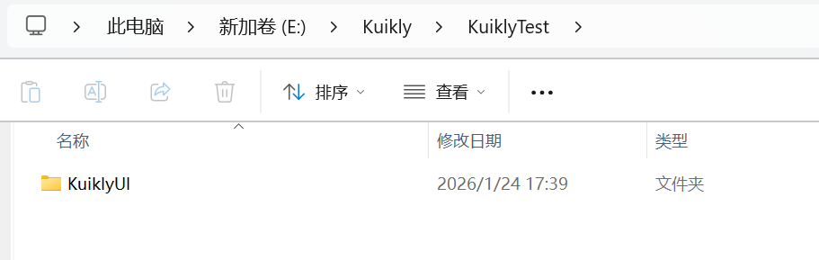

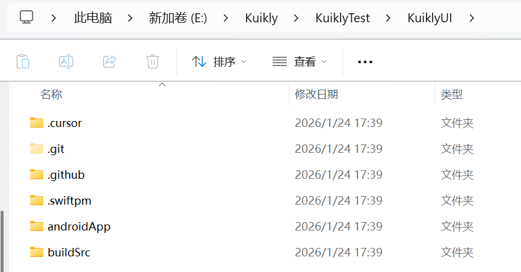

### 1.4 执行编译脚本

> 如果电脑操作系统是Windows就执行的是"**2.0_ohos_demo_build.bat**"这个脚本。
>
> 如果是Linux就执行"**2.0_ohos_demo_build.sh**"这个脚本。

这里我们以windows为例：

双击运行下方**2.0_ohos_demo_build.bat**脚本。

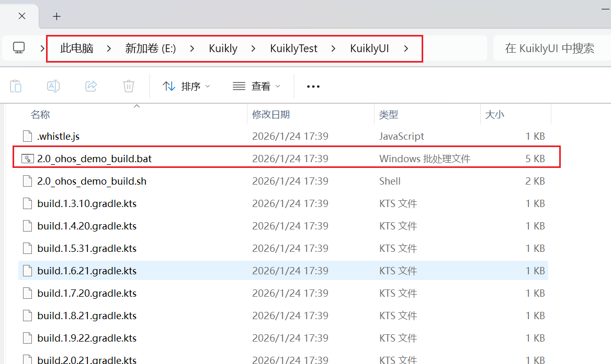

> 这里跑脚本的速度取决于cpu的性能，win的一般跑个15到20分钟，mac的 m5芯片 大约不到1分钟。

运行脚本就会弹出来一个小黑窗，注意这个100%并不是已经执行完了，后面还会接着执行，Windows整个过程大概15~30分钟左右。

如果超过这个时间，一般就是有问题了。

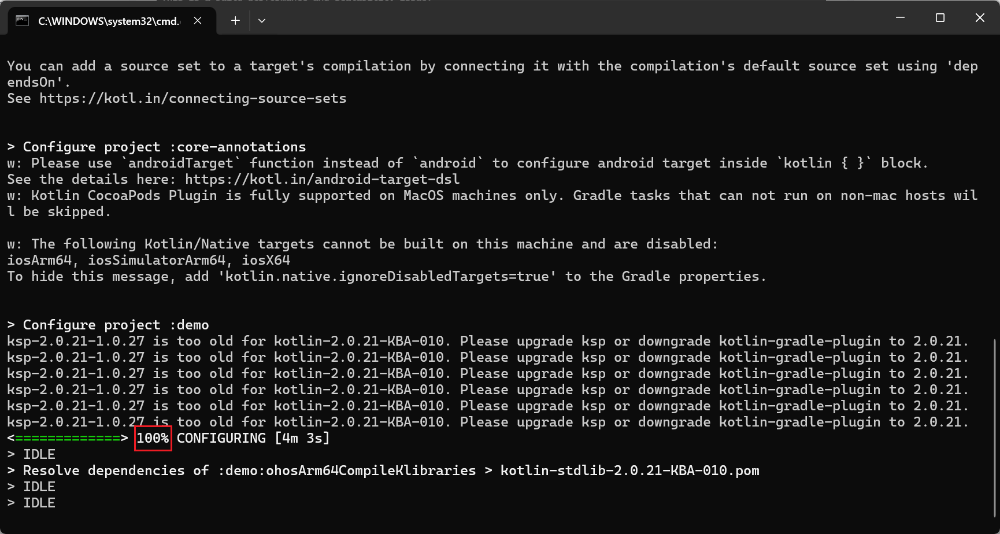

如下图显示**BUILD SUCCESSFUL**，才算是编译完成。点击任意键关闭窗口。

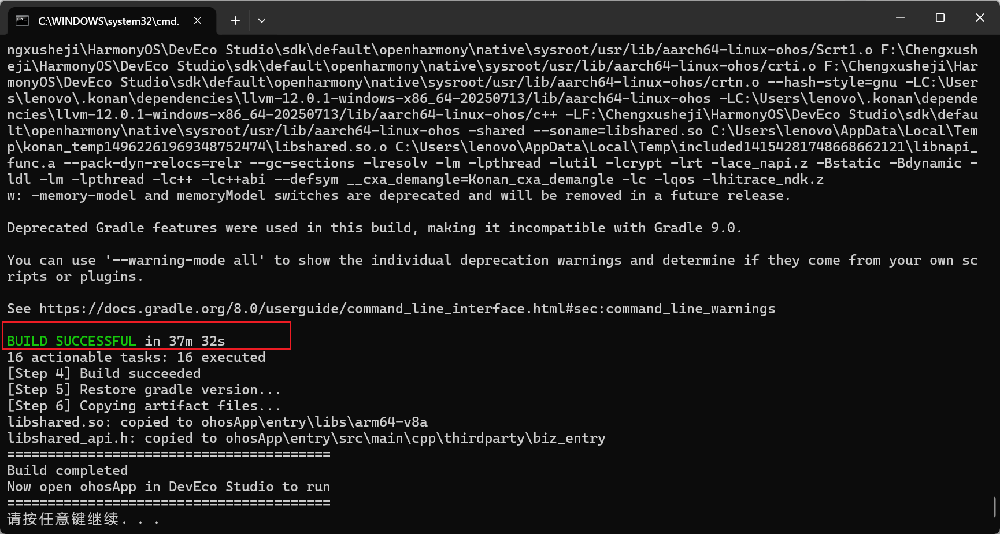

## 二、运行到真机

### 2.1 DevEco Studio打开项目

选中KuiklyUI目录中的ohosApp，点击ok即可打开，然后等待编译。

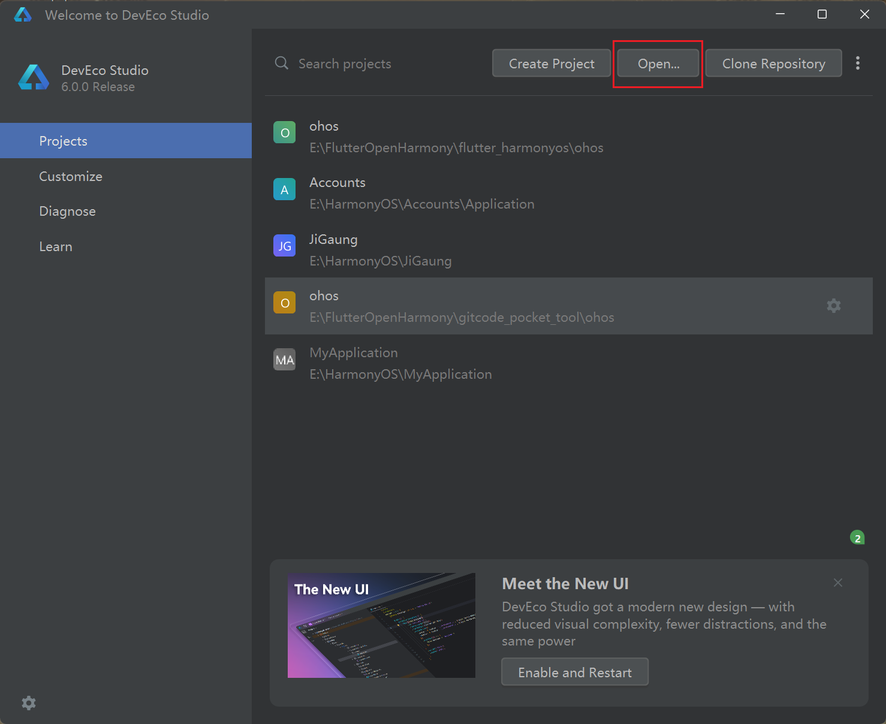

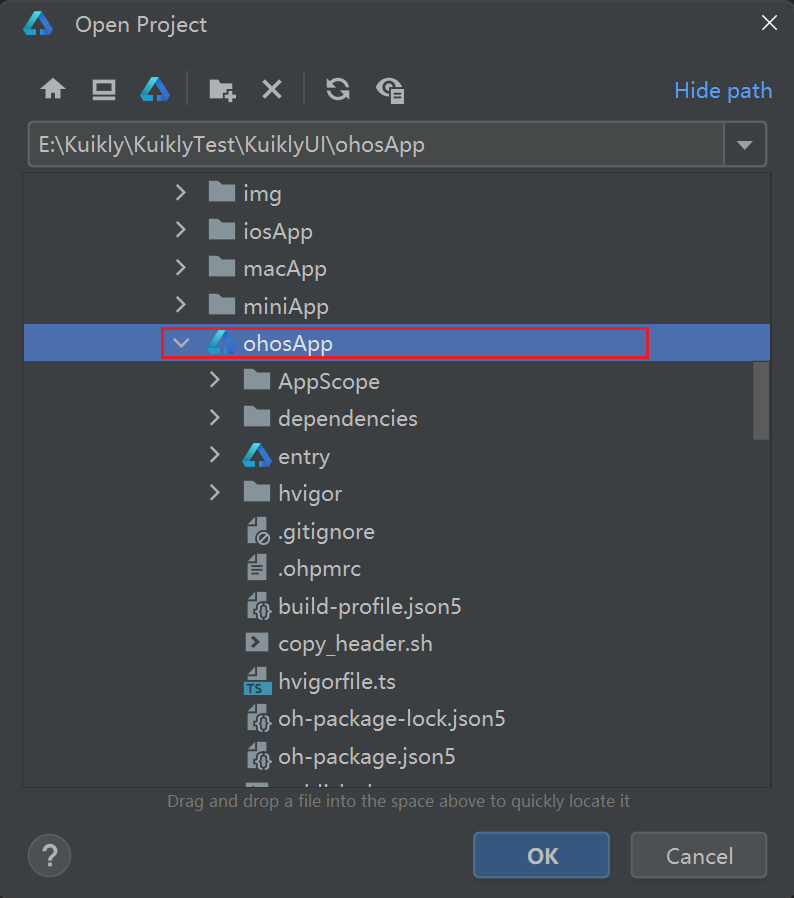

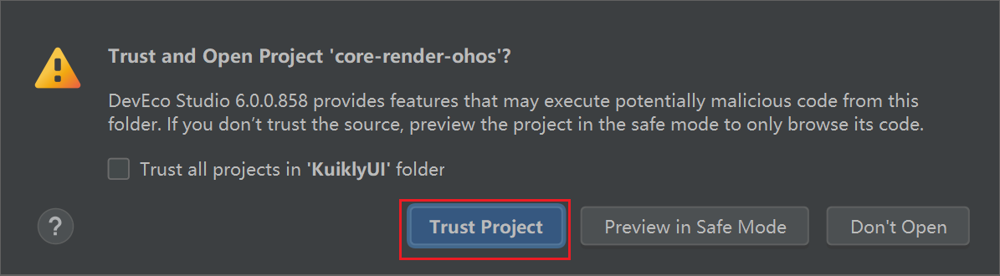

打开项目如图所示：

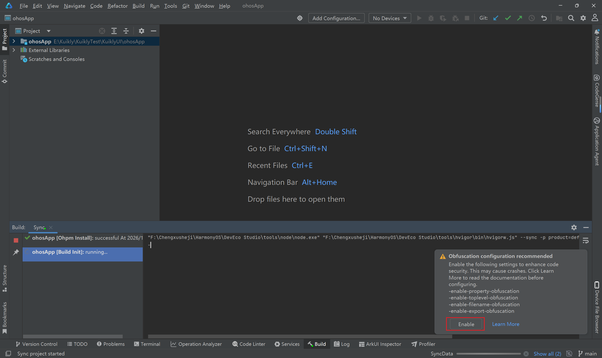

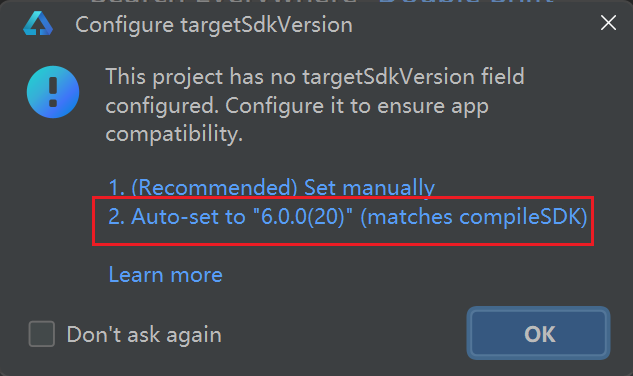

这个时候用数据线连接真机，就会显示出来真机的名称，点击运行即可。

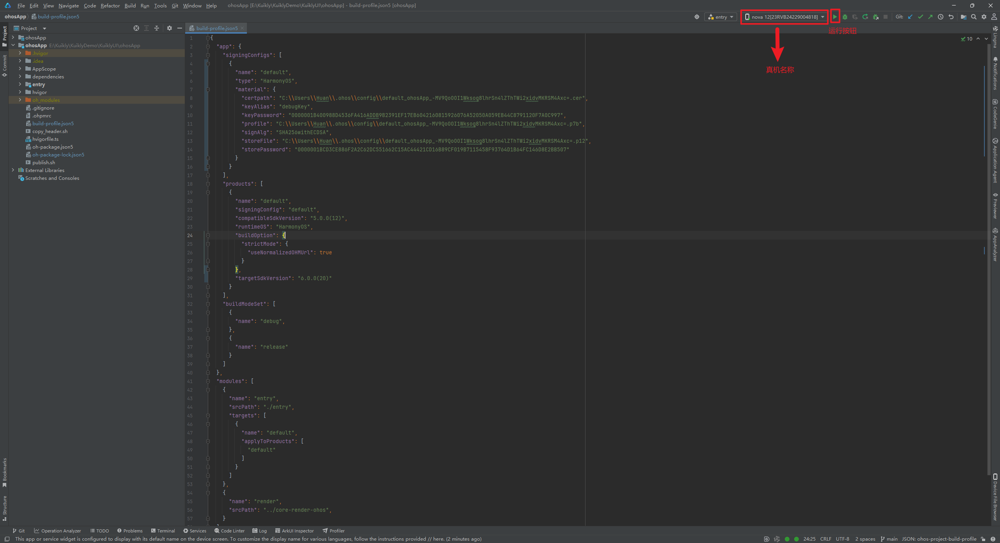

但是我们可能还会遇到两个问题

### 2.2 签名问题

这个运行了然后报错的信息就是签名问题，我们点击"Open signing configs"即可。

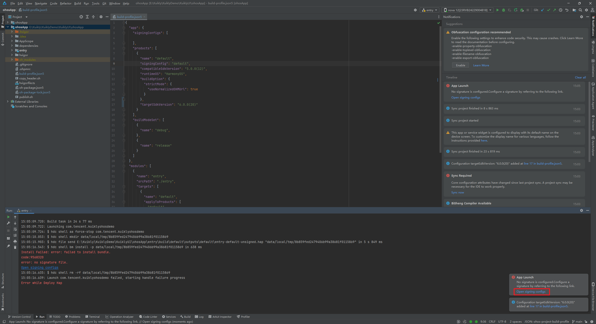

点击登录配置签名：

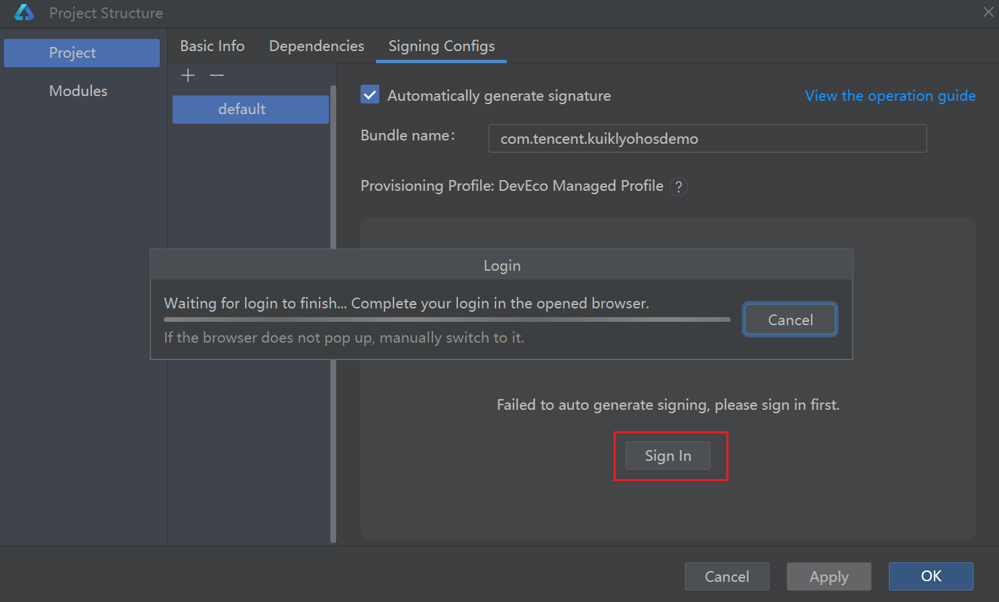

等待Signing Configs的窗口中的信息加载完成后点击Ok即可再次运行。

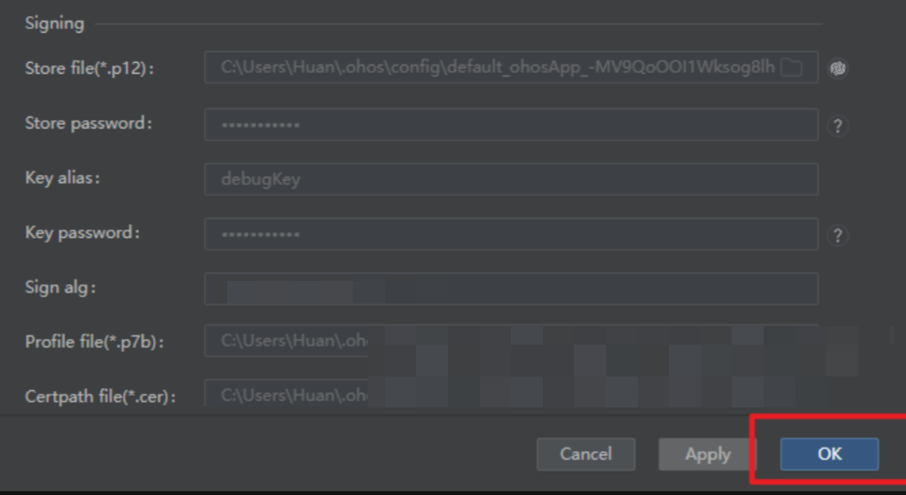

这里需要用USB连接到真机，不然会报下述错误：

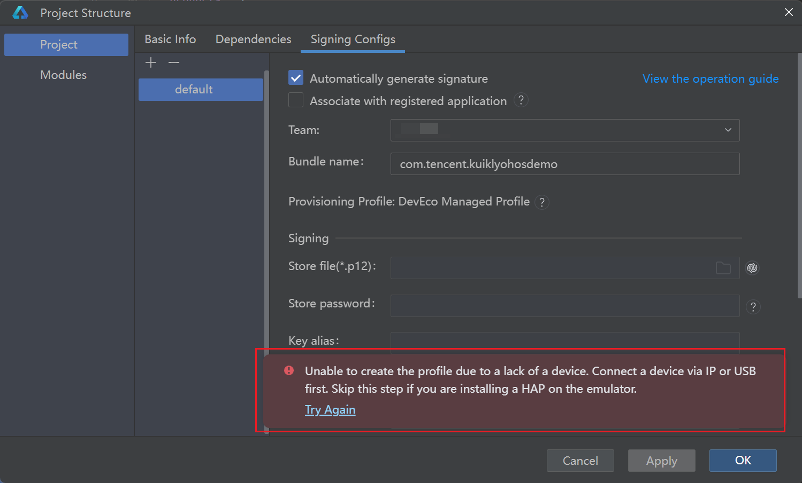

### 2.3 运行成功


